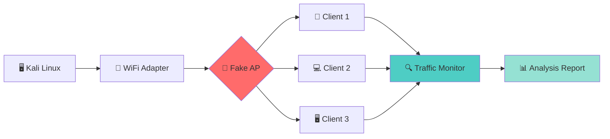

<div align="center">

# 🔬 WiFi Security Lab
### *Fake Public WiFi Testing Environment*


```ascii
╔══════════════════════════════════════════════════════════════╗
║                                                              ║
║   ██     ██ ██ ███████ ██      ██████   █████  ██████      ║
║   ██     ██ ██ ██      ██     ██    ██ ██   ██ ██   ██     ║
║   ██  █  ██ ██ █████   ██     ███████  ███████ ██████      ║
║   ██ ███ ██ ██ ██      ██     ██   ██  ██   ██ ██   ██     ║
║    ███ ███  ██ ██      ██     ██   ██  ██   ██ ██████      ║
║                                                              ║
║          🛡️ EDUCATIONAL & RESEARCH PURPOSE ONLY 🛡️           ║
║                                                              ║
╚══════════════════════════════════════════════════════════════╝
```

**Framework otomatis untuk membuat Fake Public WiFi Access Point**  
**dan monitoring traffic untuk penelitian keamanan jaringan**

[🚀 Quick Start](#-quick-start) • [📖 Documentation](#-scripts-documentation) • [⚙️ Installation](#-installation) • [🎯 Features](#-features) • [🖼️ Screenshots](#-traffic-analysis)

---

</div>

## 📑 Table of Contents

<details>
<summary>👆 Click to expand</summary>

- [🌟 Overview](#-overview)
- [✨ Key Features](#-features)
- [💻 System Requirements](#-system-requirements)
- [🎛️ Hardware Requirements](#️-hardware-requirements)
- [⚡ Installation](#-installation)
- [🚀 Quick Start](#-quick-start)
- [📖 Usage Guide](#-usage-guide)
- [📚 Scripts Documentation](#-scripts-documentation)
- [📊 Traffic Analysis](#-traffic-analysis)
- [🛠️ Troubleshooting](#️-troubleshooting)
- [⚖️ Legal Disclaimer](#️-legal-disclaimer)
- [🤝 Contributing](#-contributing)
- [👨‍💻 Author](#-author)

</details>

---

## 🌟 Overview

<div align="center">



</div>

**WiFi Security Lab** adalah framework otomatis berbasis Bash yang dirancang untuk penelitian keamanan jaringan WiFi. Tools ini memungkinkan Anda untuk:

<table>
<tr>
<td width="50%">

### 🎯 What It Does

- 🎪 **Fake Public WiFi AP** - Buat hotspot palsu otomatis
- 📡 **Traffic Monitoring** - Capture semua network traffic
- 🔍 **Deep Analysis** - HTTP, HTTPS, DNS, DHCP inspection
- 🚨 **Credential Detection** - Auto-detect data leaks
- 📊 **Comprehensive Reports** - Generate detailed analysis

</td>
<td width="50%">

### 💼 Perfect For

- ✅ Penetration Testing & Red Team
- ✅ Security Research & Education
- ✅ Network Security Auditing
- ✅ Public WiFi Awareness Training
- ✅ Capture The Flag (CTF) Events

</td>
</tr>
</table>

---

## ✨ Features

<div align="center">

### 🎭 Core Capabilities

</div>

<table>
<tr>
<td width="33%" align="center">

### 🚀 Automated Setup


✅ Auto-detect wireless interfaces  
✅ Auto-configuration network setup  
✅ Auto-detect WiFi credentials  
✅ One-click launch system  
✅ Smart interface management  

</td>
<td width="33%" align="center">

### 🛡️ Access Point


🎯 Fake Public WiFi SSID  
🌐 Built-in DHCP server  
🔄 NAT/IP Forwarding  
📶 Multi-chipset support  
🔓 Open network simulation  

</td>
<td width="33%" align="center">

### 📡 Traffic Monitor


🔴 Live traffic capture  
🕵️ HTTP/HTTPS detection  
💾 PCAP file generation  
📋 Analysis reports  
🚨 Credential leak alerts  

</td>
</tr>
</table>

<details>
<summary><b>🔬 Advanced Features - Click to expand</b></summary>

### 📊 Traffic Analysis Engine

```bash
┌─────────────────────────────────────────────────────────────┐
│  🔍 Deep Packet Inspection                                  │
│  ├── 📈 Protocol Hierarchy Analysis                         │
│  ├── 🔗 URL Extraction & Categorization                     │
│  ├── 🚨 Credential Leak Detection                           │
│  ├── 📝 Timeline of Activities                              │
│  └── 💼 Export to Multiple Formats                          │
│                                                              │
│  🖥️ Multi-Terminal Interface                                │
│  ├── 🪟 Auto-spawn multiple xterm windows                   │
│  ├── 👁️ Dedicated terminal per component                    │
│  ├── 📺 Real-time status monitoring                         │
│  └── 🎨 Color-coded output                                  │
└─────────────────────────────────────────────────────────────┘
```

### 🎯 Detection Capabilities

| Category | What's Detected | Risk Level |
|----------|----------------|------------|
| 🌐 **HTTP Traffic** | URLs, Form data, Login attempts | 🔴 HIGH |
| 🔒 **HTTPS Metadata** | SNI, Domains, Certificate info | 🟡 MEDIUM |
| 📡 **DNS Queries** | All domain lookups, Browsing patterns | 🟡 MEDIUM |
| 💻 **DHCP** | MAC addresses, Device hostnames | 🟢 LOW |
| 📧 **Email Protocols** | SMTP, POP3, IMAP (unencrypted) | 🔴 HIGH |
| 🗣️ **VoIP/SIP** | Call metadata, Unencrypted audio | 🟠 MEDIUM |

</details>

---

## 💻 System Requirements

<div align="center">

### 🐧 Operating System

</div>

<table>
<tr>
<td width="50%">

#### ✅ Recommended

```bash
OS: Kali Linux 2023.x+
Architecture: x86_64 / ARM64
GUI: X11 Environment
Kernel: Linux 5.x+
```

**Why Kali Linux?**
- ✅ Pre-installed security tools
- ✅ Optimized drivers for WiFi adapters
- ✅ Regular security updates
- ✅ Community support

</td>
<td width="50%">

#### 🔧 Also Compatible

```bash
✅ Parrot Security OS
✅ BlackArch Linux
✅ Ubuntu 22.04+ (manual setup)
✅ Debian 11+ (manual setup)
```

**Requirements:**
- Root access (sudo)
- Active internet connection
- X11/Wayland display server

</td>
</tr>
</table>

### 📦 Required Software Packages

<details>
<summary><b>Click to view installation commands</b></summary>

```bash
# Core Network Tools
sudo apt update && sudo apt install -y \
    hostapd \          # Access Point daemon
    dnsmasq \          # DHCP & DNS server
    iptables \         # Firewall & NAT
    iw \               # Wireless configuration
    rfkill \           # Radio kill switch control
    wireless-tools     # Legacy wireless tools

# Monitoring & Analysis
sudo apt install -y \
    tshark \           # CLI packet analyzer
    wireshark \        # GUI packet analyzer
    tcpdump \          # Packet capture utility
    aircrack-ng        # WiFi security suite

# Network Management
sudo apt install -y \
    network-manager \  # Network configuration
    wpasupplicant \    # WPA authentication
    dhcpcd5            # DHCP client

# Interface & Display
sudo apt install -y \
    xterm \            # Terminal emulator
    tmux \             # Terminal multiplexer (optional)
    screen             # Alternative multiplexer (optional)
```

#### 🚀 One-Line Installation

```bash
sudo apt update && sudo apt install -y hostapd dnsmasq iptables iw tshark network-manager xterm wireshark tcpdump aircrack-ng rfkill wireless-tools wpasupplicant dhcpcd5
```

</details>

---

## 🎛️ Hardware Requirements

<div align="center">

### ⚠️ CRITICAL: WiFi Adapter Compatibility

</div>

> **🚨 IMPORTANT:** Framework ini **MEMBUTUHKAN** WiFi adapter yang support **AP (Access Point) Mode**.  
> Built-in laptop WiFi cards biasanya **TIDAK SUPPORT** mode ini!

<details open>
<summary><b>🏆 Top Recommended WiFi Adapters - TESTED & VERIFIED</b></summary>

### 💎 Premium Tier (Professional Use)

| Model | Chipset | AP | Monitor | Range | Price | Rating |
|-------|---------|----|---------| ------|-------|--------|
| **🥇 Alfa AWUS036ACH** | Realtek RTL8812AU | ✅ | ✅ | 🟢🟢🟢🟢🟢 | $45-60 | ⭐⭐⭐⭐⭐ |
| **🥈 Alfa AWUS036NHA** | Atheros AR9271 | ✅ | ✅ | 🟢🟢🟢🟢 | $30-40 | ⭐⭐⭐⭐⭐ |
| **🥉 Alfa AWUS036NEH** | Realtek RTL8188EUS | ✅ | ✅ | 🟢🟢🟢🟢 | $35-45 | ⭐⭐⭐⭐ |

**Features:**
- ✅ Dual Band (2.4GHz + 5GHz)
- ✅ High TX Power (up to 1000mW)
- ✅ External Antenna
- ✅ Plug & Play di Kali Linux
- ✅ Excellent Range & Stability

### 💰 Budget-Friendly Options

| Model | Chipset | AP | Monitor | Price | Notes |
|-------|---------|----|---------| ------|-------|
| **TP-Link TL-WN722N v1** | Atheros AR9271 | ✅ | ✅ | $10-15 | 🏆 **Best Budget Choice** |
| **Panda PAU09** | Ralink RT5572 | ✅ | ✅ | $25-35 | Dual Band |
| **TP-Link Archer T2U** | MediaTek MT7610U | ✅ | ✅ | $15-20 | Compact Size |
| **Panda PAU05** | Ralink RT5370 | ✅ | ✅ | $12-18 | Reliable |

**Perfect for:**
- 🎓 Learning & Training
- 🧪 Lab Testing
- 💼 Budget Projects

### 🚫 NOT Recommended (No AP Support)

<table>
<tr>
<td width="50%">

**❌ Intel Wireless Cards**
```
- Intel WiFi 6 AX200/201
- Intel Wireless AC 9260/9560
- Intel Centrino series
```
*Most Intel cards do NOT support AP mode*

</td>
<td width="50%">

**❌ Broadcom Chipsets**
```
- BCM43142
- BCM4313
- BCM43xx series
```
*Poor Linux driver support*

</td>
</tr>
</table>

</details>

<details>
<summary><b>🔍 How to Check Your Adapter Compatibility</b></summary>

### Method 1: Check AP Mode Support

```bash
# List all wireless interfaces
sudo iw dev

# Check if interface supports AP mode
sudo iw list | grep -A 10 "Supported interface modes"
```

**✅ Good Output (AP Mode Supported):**
```
Supported interface modes:
    * IBSS
    * managed
    * AP          ← 🎯 YOU NEED THIS!
    * monitor
    * mesh point
    * P2P-client
    * P2P-GO
```

**❌ Bad Output (AP Mode NOT Supported):**
```
Supported interface modes:
    * managed     ← Only client mode
    * monitor
```

### Method 2: Quick Test

```bash
# Try to create AP interface
sudo iw dev wlan0 interface add ap0 type __ap

# If successful, you'll see:
# (no error message)

# Clean up
sudo iw dev ap0 del
```

### Method 3: Check Chipset

```bash
# Identify your WiFi chipset
lsusb | grep -i wireless
# or
lspci | grep -i wireless

# Then Google: "[chipset name] AP mode support Linux"
```

</details>

<details>
<summary><b>🛒 Where to Buy & Price Comparison</b></summary>

### 🌍 International

| Store | Alfa AWUS036ACH | TP-Link TL-WN722N v1 | Shipping |
|-------|----------------|---------------------|----------|
| **Amazon.com** | $49.99 | $14.99 | 📦 Fast (2-3 days) |
| **AliExpress** | $38-45 | $8-12 | 🚢 Slow (15-30 days) |
| **eBay** | $45-55 | $12-18 | 📦 Varies |
| **Official Store** | $59.99 | N/A | 📦 Standard |

### 🇮🇩 Indonesia

| Store | Alfa Series | TP-Link | Notes |
|-------|------------|---------|-------|
| **Tokopedia** | Rp 600K - 850K | Rp 100K - 150K | ✅ Cashback |
| **Shopee** | Rp 550K - 800K | Rp 90K - 140K | ✅ Free Shipping |
| **Bukalapak** | Rp 580K - 820K | Rp 95K - 145K | ✅ Cicilan |
| **Offline Store** | Rp 700K - 900K | Rp 120K - 180K | ⚠️ Higher Price |

**💡 Pro Shopping Tips:**
- ✅ Check seller rating & reviews
- ✅ Verify it's the correct version (TL-WN722N **v1**, not v2/v3)
- ✅ Look for "monitor mode" or "AP mode" in description
- ✅ Buy from reputable WiFi security tool sellers

</details>

### 💡 Recommended Setup

<table>
<tr>
<td width="50%">

#### 🎯 Optimal Configuration

```
╔════════════════════════════════╗
║  🖥️ Laptop/PC (Kali Linux)    ║
║  ├── 📡 Built-in WiFi (wlan0)  ║
║  │   └── Internet Connection   ║
║  └── 🔌 USB WiFi (wlan1)       ║
║      └── Fake AP               ║
╚════════════════════════════════╝
```

**Why 2 adapters?**
- ✅ Simultaneous internet + AP
- ✅ Better performance
- ✅ More realistic testing

</td>
<td width="50%">

#### 🔧 Minimum Configuration

```
╔════════════════════════════════╗
║  🖥️ Laptop/PC (Kali Linux)    ║
║  └── 🔌 USB WiFi (wlan0)       ║
║      ├── Internet (when needed)║
║      └── Fake AP (when testing)║
╚════════════════════════════════╝
```

**Works but limited:**
- ⚠️ Cannot have internet + AP simultaneously
- ⚠️ Need to switch modes manually

</td>
</tr>
</table>

---

## ⚡ Installation

<div align="center">

### 🚀 Get Started in 3 Minutes

</div>

### Step 1️⃣: Clone Repository

```bash
# Navigate to your preferred directory
cd ~/Documents

# Clone the repository
git clone https://github.com/grnlogic/wifi-lab.git

# Enter the directory
cd wifi-lab
```

### Step 2️⃣: Install Dependencies

<details>
<summary><b>📦 Click for installation commands</b></summary>

```bash
# Update package list
sudo apt update

# Install all required packages
sudo apt install -y \
    hostapd \
    dnsmasq \
    iptables \
    iw \
    tshark \
    network-manager \
    xterm \
    wireshark \
    tcpdump \
    aircrack-ng \
    rfkill \
    wireless-tools \
    wpasupplicant \
    dhcpcd5

# Verify installation
echo "Checking installations..."
command -v hostapd >/dev/null && echo "✅ hostapd" || echo "❌ hostapd"
command -v dnsmasq >/dev/null && echo "✅ dnsmasq" || echo "❌ dnsmasq"
command -v tshark >/dev/null && echo "✅ tshark" || echo "❌ tshark"
```

</details>

### Step 3️⃣: Make Scripts Executable

```bash
# Make all scripts executable
chmod +x *.sh

# Verify permissions
ls -lah *.sh
```

### Step 4️⃣: Auto-Detect Your Interfaces

```bash
# Run auto-detection script
sudo ./auto-detect-interface.sh
```

**This script will:**
- 🔍 Detect interfaces yang support AP mode
- ✏️ Update semua config files otomatis
- ✅ Verify network setup
- 🎯 Siap untuk dijalankan!

<div align="center">

### ✨ Installation Complete!

```ascii
╔═══════════════════════════════════════╗
║                                       ║
║     ✅ Installation Successful!       ║
║                                       ║
║     Ready to launch WiFi Lab 🚀      ║
║                                       ║
╚═══════════════════════════════════════╝
```

</div>

---

## 🚀 Quick Start

<div align="center">

### 🎯 Launch in 10 Seconds

</div>

### Method 1: 🌟 Auto Launch (Recommended)

```bash
sudo ./launch-all.sh
```

<details>
<summary><b>🎬 What happens when you run this?</b></summary>

```
┌─────────────────────────────────────────────────────────────┐
│  Step 1: 🔍 Auto-detect wireless interfaces                 │
│           └── Scanning for AP-capable adapters...           │
│                                                              │
│  Step 2: 🎪 Start Access Point "Fake_Public_WiFi"           │
│           ├── Configuring hostapd...                        │
│           ├── Starting DHCP server...                       │
│           └── AP is LIVE! 📡                                │
│                                                              │
│  Step 3: 🌐 Auto-detect WiFi credentials                    │
│           └── Found saved network: "Home_WiFi"              │
│                                                              │
│  Step 4: 🔗 Connect internet via wlan0                      │
│           ├── Connecting to router...                       │
│           ├── Getting IP address...                         │
│           └── Internet connected! ✅                         │
│                                                              │
│  Step 5: 📡 Start traffic monitoring                        │
│           ├── Capturing packets...                          │
│           └── Live analysis running! 🔴                     │
│                                                              │
│  Step 6: 🖥️ Open monitoring terminals                       │
│           ├── [Terminal 1] Access Point Status             │
│           ├── [Terminal 2] Traffic Monitor                 │
│           ├── [Terminal 3] DHCP Leases                     │
│           └── [Terminal 4] Analysis Console                │
│                                                              │
│  ✨ All systems operational!                                │
└─────────────────────────────────────────────────────────────┘
```

</details>

### Method 2: 🔧 Manual Step-by-Step

<details>
<summary><b>For advanced users who want more control</b></summary>

```bash
# Step 1: Setup and detect interfaces
sudo ./auto-detect-interface.sh

# Step 2: Start the Access Point
sudo ./start-ap.sh

# Step 3: (Optional) Setup internet sharing
sudo ./auto-detect-wifi.sh
sudo ./connect-internet.sh

# Step 4: Monitor traffic
sudo ./monitor-traffic.sh

# Step 5: (Optional) Analyze captured traffic
sudo ./analyze-capture.sh ./captures/traffic_*.pcap
```

</details>

### 🛑 Stop All Services

```bash
# Graceful shutdown of all components
sudo ./stop-all.sh
```

<div align="center">

### 🎮 Ready to Test!

**Now connect your test devices to the network:**

```
📱 Network Name: Fake_Public_WiFi
🔓 Password: (None - Open Network)
🌐 Gateway: 10.0.0.1
```

</div>

---

## 📖 Usage Guide

<div align="center">

### 🎭 Real-World Scenarios

</div>

### 🎪 Scenario 1: Basic AP Setup (No Internet)

<details>
<summary><b>Perfect for: Capturing local network traffic</b></summary>

```bash
# Step 1: Start the Access Point
sudo ./start-ap.sh

# You'll see:
# ✅ Access Point started on wlan1
# ✅ SSID: Fake_Public_WiFi
# ✅ Gateway: 10.0.0.1
# ✅ DHCP Range: 10.0.0.10 - 10.0.0.100

# Step 2: Start monitoring
sudo ./monitor-traffic.sh

# Step 3: Connect your test device
# - Open WiFi settings
# - Connect to "Fake_Public_WiFi"
# - No password needed

# Step 4: Test browsing
# - Try to access websites
# - See all traffic in monitor terminal
# - Watch HTTP, DNS, DHCP packets

# Step 5: Analyze when done
sudo ./analyze-capture.sh ./captures/traffic_*.pcap
```

**Use Case:**
- ✅ Training demonstrations
- ✅ Offline testing
- ✅ Protocol analysis
- ✅ DHCP fingerprinting

</details>

### 🌐 Scenario 2: Internet-Enabled Fake AP

<details>
<summary><b>Perfect for: Realistic public WiFi simulation</b></summary>

```bash
# Preparation: Ensure Kali is connected to internet via wlan0 or ethernet

# Step 1: Auto-detect internet connection
sudo ./auto-detect-wifi.sh

# Output will show:
# 🔍 Found WiFi connection: "Home_WiFi"
# 🔑 Password retrieved from NetworkManager
# ✅ Configuration updated

# Step 2: Launch everything
sudo ./launch-all.sh

# This will:
# ├── Start Fake AP on wlan1
# ├── Connect to real internet on wlan0
# ├── Setup NAT forwarding
# ├── Start traffic monitoring
# └── Open 4 monitoring terminals

# Now clients can:
# ✅ Connect to "Fake_Public_WiFi"
# ✅ Access real internet
# ✅ All traffic is captured!

# Monitor traffic in real-time across terminals
```

**Use Case:**
- ✅ Realistic penetration testing
- ✅ Man-in-the-middle demonstrations
- ✅ Security awareness training
- ✅ Full traffic analysis

</details>

### 🔍 Scenario 3: Advanced Traffic Analysis

<details>
<summary><b>Perfect for: Deep packet inspection & forensics</b></summary>

```bash
# After capturing traffic for a while...

# Step 1: Stop monitoring (Ctrl+C in monitor terminal)

# Step 2: List all capture files
ls -lh ./captures/

# Output:
# -rw-r--r-- 1 root root 45M Jan 31 14:30 traffic_20260131_143000.pcap
# -rw-r--r-- 1 root root 12K Jan 31 14:30 analysis_20260131_143000.txt

# Step 3: Analyze the PCAP file
sudo ./analyze-capture.sh ./captures/traffic_20260131_143000.pcap

# The script will generate:
# ├── Protocol hierarchy statistics
# ├── HTTP requests & responses
# ├── DNS queries timeline
# ├── Credentials detection (POST data)
# ├── TLS/SSL connections
# ├── Top domains visited
# └── Client device fingerprinting

# Step 4: Review the analysis report
cat ./captures/analysis_20260131_143000.txt

# Step 5: (Optional) Open in Wireshark for GUI analysis
wireshark ./captures/traffic_20260131_143000.pcap &
```

**Advanced Filters in Wireshark:**
```wireshark
# Show only HTTP POST requests (possible credentials)
http.request.method == "POST"

# Show only unencrypted HTTP traffic
http and not ssl

# Show DNS queries
dns

# Show specific client traffic
ip.addr == 10.0.0.50

# Show credentials in forms
http.request.method == "POST" and http.file_data contains "password"
```

</details>

### 🎯 Scenario 4: Quick Demo/Testing

<details>
<summary><b>Perfect for: Quick demonstrations or testing</b></summary>

```bash
# Quick 30-second capture demo
sudo ./demo-capture.sh

# This will:
# ├── Capture traffic for 30 seconds
# ├── Auto-analyze the capture
# ├── Generate summary report
# └── Open results automatically

# Output files:
# ./captures/demo_capture_[timestamp].pcap
# ./captures/demo_analysis_[timestamp].txt
```

**Perfect for:**
- ⚡ Quick functionality tests
- 🎓 Classroom demonstrations
- 🧪 Initial setup verification
- 📊 Sample data generation

</details>

---

## 📚 Scripts Documentation

<div align="center">

### 🛠️ Complete Script Reference

</div>

### 🎯 Core Operational Scripts

<table>
<tr>
<td width="50%">

#### `launch-all.sh` 🚀
**Master launcher** - Everything in one command

```bash
sudo ./launch-all.sh
```

**What it does:**
- ✅ Auto-detect interfaces
- ✅ Start Access Point
- ✅ Auto-detect WiFi credentials
- ✅ Connect internet
- ✅ Start traffic monitoring
- ✅ Open multiple terminal windows
- ✅ Setup complete monitoring dashboard

**Terminal Layout:**
```
┌─────────────┬─────────────┐
│   AP Status │   Traffic   │
│             │   Monitor   │
├─────────────┼─────────────┤
│ DHCP Leases │  Analysis   │
│             │   Console   │
└─────────────┴─────────────┘
```

</td>
<td width="50%">

#### `start-ap.sh` 📡
Setup dan jalankan Fake Access Point

```bash
sudo ./start-ap.sh
```

**Configuration:**
- 🎯 SSID: `Fake_Public_WiFi`
- 🔓 Security: Open (No password)
- 🌐 Gateway: `10.0.0.1`
- 📊 DHCP Range: `10.0.0.10 - 10.0.0.100`
- 🔧 Channel: 6 (2.4GHz)

**Features:**
- Configures `hostapd` daemon
- Starts `dnsmasq` DHCP server
- Sets up network bridge
- Enables IP forwarding

</td>
</tr>
</table>

<details>
<summary><b>🔧 Network Management Scripts</b></summary>

### `stop-ap.sh` 🛑
Stop Access Point dan restore settings

```bash
sudo ./stop-ap.sh
```

**Actions performed:**
- 🛑 Stop hostapd service
- 🛑 Stop dnsmasq service
- 🔄 Restore network configurations
- 🧹 Clean up iptables rules
- 📊 Reset interface states

---

### `connect-internet.sh` 🌐
Connect wlan0 ke internet router

```bash
sudo ./connect-internet.sh
```

**Process:**
1. Read WiFi credentials from config
2. Stop conflicting NetworkManager
3. Use `wpa_supplicant` to connect
4. Get IP via `dhcpcd`
5. Setup NAT rules for internet sharing

**Supports:**
- ✅ WPA/WPA2 networks
- ✅ Open networks
- ✅ Hidden SSIDs
- ⚠️ WEP (deprecated, not recommended)

---

### `stop-all.sh` ⛔
Emergency stop - Kill everything

```bash
sudo ./stop-all.sh
```

**Cleanup:**
- 🛑 Stop AP services
- 🛑 Kill monitoring processes
- 🛑 Close all xterm windows
- 🧹 Remove PID files
- 🔄 Restore NetworkManager
- 📋 Generate final summary

</details>

<details>
<summary><b>🔍 Auto-Detection Scripts</b></summary>

### `auto-detect-interface.sh` 🎯
Smart interface detection and configuration

```bash
sudo ./auto-detect-interface.sh
```

**Detection Logic:**
```
1. Scan all wireless interfaces
   ↓
2. Check AP mode support (iw list)
   ↓
3. Prioritize external USB adapters
   ↓
4. Assign roles:
   - AP Interface (wlan1)
   - Internet Interface (wlan0)
   ↓
5. Update all config files:
   - hostapd.conf
   - dnsmasq.conf
   - start-ap.sh
   - monitor-traffic.sh
   ↓
6. Verify configuration
```

**Output Example:**
```
🔍 Detecting wireless interfaces...
✅ Found wlan0: Managed mode only (Internet)
✅ Found wlan1: AP mode support! (Access Point)

📝 Updating configurations...
✅ Updated: hostapd.conf
✅ Updated: dnsmasq.conf
✅ Updated: start-ap.sh

🎯 Configuration Summary:
   AP Interface: wlan1
   Internet Interface: wlan0
   Ready to launch! 🚀
```

---

### `auto-detect-wifi.sh` 📡
Auto-detect existing WiFi credentials

```bash
sudo ./auto-detect-wifi.sh
```

**How it works:**
```
1. Query NetworkManager for active connections
   ↓
2. Extract SSID from active WiFi
   ↓
3. Retrieve password from NetworkManager secrets
   ↓
4. Update connect-internet.sh with credentials
   ↓
5. Backup existing configuration
```

**Security Note:**
- Passwords are stored in plain text config (for automation)
- Files are readable only by root
- Consider using temporary test networks

</details>

<details>
<summary><b>📡 Monitoring & Analysis Scripts</b></summary>

### `monitor-traffic.sh` 🔴
Real-time traffic monitoring with live analysis

```bash
sudo ./monitor-traffic.sh
```

**Features:**
```
┌─────────────────────────────────────────────┐
│  🔴 LIVE TRAFFIC MONITOR                    │
├─────────────────────────────────────────────┤
│                                             │
│  [11:24:15] [DHCP] 10.0.0.50 - Discover    │
│  [11:24:16] [DNS]  10.0.0.50 → google.com  │
│  [11:24:17] [HTTP] GET http://example.com  │
│  [11:24:18] [POST] ⚠️  Possible credentials│
│                                             │
│  📊 Stats:                                  │
│  └── Packets: 1,234                        │
│  └── HTTP: 45 | DNS: 78 | DHCP: 3         │
│                                             │
└─────────────────────────────────────────────┘
```

**Detection Patterns:**
- 🌐 HTTP GET/POST requests
- 🔒 HTTPS ClientHello (SNI extraction)
- 📡 DNS A/AAAA queries
- 💻 DHCP Discover/Request/ACK
- 📧 Email protocols (SMTP, POP3, IMAP)
- ⚠️ Credential indicators in POST data

**Output Files:**
- `./captures/traffic_[timestamp].pcap` - Raw capture
- `./captures/analysis_[timestamp].txt` - Live analysis log

---

### `analyze-capture.sh` 📊
Deep packet inspection & forensics

```bash
sudo ./analyze-capture.sh <file.pcap>
```

**Example:**
```bash
# Analyze latest capture
sudo ./analyze-capture.sh ./captures/traffic_20260131_143000.pcap

# Analyze Wireshark export
sudo ./analyze-capture.sh /tmp/wireshark_capture.pcapng
```

**Analysis Sections:**

1. **📋 Capture Info**
   - File size, packet count
   - Time range, duration
   - Interface used

2. **📊 Protocol Hierarchy**
   ```
   Ethernet (100%)
   └── IPv4 (98.5%)
       ├── TCP (75%)
       │   ├── HTTP (30%)
       │   ├── HTTPS (40%)
       │   └── Other (5%)
       └── UDP (25%)
           ├── DNS (80%)
           └── DHCP (20%)
   ```

3. **🌐 HTTP Analysis**
   - All HTTP requests with timestamps
   - User-Agent detection
   - Referer tracking
   - Cookie analysis

4. **🔒 HTTPS/TLS Analysis**
   - SNI (Server Name Indication)
   - Certificate information
   - Cipher suites used

5. **📡 DNS Queries**
   - Timeline of all lookups
   - Domain categorization
   - Query types (A, AAAA, MX, etc.)

6. **💻 DHCP Transactions**
   - Device MAC addresses
   - Assigned IP addresses
   - Hostname fingerprinting
   - Vendor identification

7. **🚨 Credential Detection**
   - POST request analysis
   - Form data extraction
   - Authentication attempts
   - Base64 decoded data

8. **📈 Statistics**
   - Top talkers (by traffic volume)
   - Most visited domains
   - Protocol distribution
   - Traffic timeline

---

### `demo-capture.sh` ⚡
Quick 30-second demo capture

```bash
sudo ./demo-capture.sh
```

**Process:**
```
1. Start packet capture
2. Wait 30 seconds
3. Stop capture
4. Auto-analyze
5. Display summary
6. Save to ./captures/demo_*
```

---

### `test-monitoring.sh` 🧪
Test monitoring without actual AP

```bash
sudo ./test-monitoring.sh
```

**Purpose:**
- Test tshark installation
- Verify packet capture capability
- Check analysis scripts
- Troubleshoot monitoring issues

</details>

---

## 📊 Traffic Analysis

<div align="center">

### 🔬 Deep Dive into Captured Data

</div>

### 📁 Output File Structure

```
wifi-lab/
└── captures/
    ├── traffic_20260131_143000.pcap          # Raw packet capture
    ├── analysis_20260131_143000.txt          # Detailed analysis
    ├── SUMMARY_LATEST_CAPTURE.txt            # Quick summary
    └── demo_capture_[timestamp].pcap         # Demo captures
```

### 📝 Sample Analysis Report

<details>
<summary><b>Click to view full sample report</b></summary>

```
=================================================================
           TRAFFIC ANALYSIS REPORT - Fake_Public_WiFi
=================================================================
Generated: Fri Jan 31 14:35:42 WIB 2026
Capture File: traffic_20260131_143000.pcap
Interface: wlan1
Duration: 15 minutes 30 seconds

=================================================================
CAPTURE STATISTICS
=================================================================
Total Packets: 15,234
Total Size: 12.3 MB
Average Rate: 16.4 packets/second

Protocol Distribution:
├── Ethernet: 100%
├── IPv4: 95.2%
├── IPv6: 4.8%
├── TCP: 65.3%
├── UDP: 30.1%
└── Other: 4.6%

=================================================================
CONNECTED CLIENTS (DHCP)
=================================================================
[14:20:15] 10.0.0.50 - aa:bb:cc:dd:ee:01 - "Samsung-Galaxy-S21"
[14:21:03] 10.0.0.51 - aa:bb:cc:dd:ee:02 - "iPhone-13-Pro"
[14:22:45] 10.0.0.52 - aa:bb:cc:dd:ee:03 - "DESKTOP-WIN10"

Total Unique Clients: 3

=================================================================
DNS QUERIES TIMELINE
=================================================================
[14:20:18] 10.0.0.50 → www.google.com (A)
[14:20:19] 10.0.0.50 → www.facebook.com (A)
[14:20:25] 10.0.0.51 → api.twitter.com (A)
[14:21:10] 10.0.0.50 → fonts.googleapis.com (A)
[14:21:15] 10.0.0.52 → update.microsoft.com (A)
... (145 more queries)

Top 10 Domains:
1. www.google.com (23x)
2. www.facebook.com (18x)
3. api.twitter.com (15x)
4. cdn.jsdelivr.net (12x)
5. fonts.googleapis.com (10x)
6. www.youtube.com (9x)
7. instagram.com (8x)
8. cloudflare.com (7x)
9. amazonaws.com (6x)
10. github.com (5x)

=================================================================
HTTP TRAFFIC ANALYSIS
=================================================================
[14:20:30] [GET] http://example.com/
  └── User-Agent: Mozilla/5.0 (Android 12; SM-G998B)
  └── Client: 10.0.0.50

[14:20:35] [GET] http://neverssl.com/
  └── User-Agent: Mozilla/5.0 (iPhone; CPU iPhone OS 15_0)
  └── Client: 10.0.0.51

[14:21:45] [POST] http://insecure-login.example.com/auth ⚠️
  └── User-Agent: Mozilla/5.0 (Windows NT 10.0; Win64; x64)
  └── Client: 10.0.0.52
  └── ⚠️ WARNING: POST data detected (possible credentials)

Total HTTP Requests: 67
Total HTTP POST: 4 ⚠️

=================================================================
⚠️  CREDENTIAL LEAK DETECTION
=================================================================
[14:21:45] POST to http://insecure-login.example.com/auth
  Client: 10.0.0.52 (DESKTOP-WIN10)
  Form Data Detected:
  ├── username=john.doe
  ├── password=[REDACTED - 12 characters]
  └── remember=true

[14:23:12] POST to http://api.oldservice.com/login
  Client: 10.0.0.50 (Samsung-Galaxy-S21)
  JSON Payload Detected:
  ├── email=user@example.com
  └── pass=[REDACTED - 8 characters]

🚨 CRITICAL: 2 unencrypted authentication attempts detected!

=================================================================
TLS/HTTPS CONNECTIONS
=================================================================
[14:20:40] ClientHello → www.google.com:443
  └── SNI: www.google.com
  └── Cipher Suite: TLS_AES_128_GCM_SHA256

[14:20:45] ClientHello → www.facebook.com:443
  └── SNI: www.facebook.com
  └── Cipher Suite: TLS_CHACHA20_POLY1305_SHA256

[14:21:00] ClientHello → api.twitter.com:443
  └── SNI: api.twitter.com
  └── Cipher Suite: TLS_AES_256_GCM_SHA384

Total TLS Connections: 89
✅ Encrypted traffic (payload not readable)
⚠️ Metadata visible: domains, timing, size

=================================================================
NETWORK ACTIVITY TIMELINE
=================================================================
14:20:00 ────────────────────────────────────────────
         │
14:20:15 ├── 📱 Samsung-Galaxy-S21 connected
         │   └── Started browsing
         │
14:21:03 ├── 📱 iPhone-13-Pro connected
         │   └── Checking social media
         │
14:21:45 ├── ⚠️  Unencrypted login attempt (DESKTOP-WIN10)
         │   └── Credentials captured!
         │
14:22:45 ├── 💻 DESKTOP-WIN10 connected
         │   └── Windows Update activity
         │
14:25:30 ├── 📊 Peak traffic (45 packets/sec)
         │   └── Multiple clients browsing
         │
14:35:00 └── Capture ended

=================================================================
SECURITY FINDINGS SUMMARY
=================================================================
✅ Good Practices Observed:
   ├── 89 HTTPS connections (encrypted)
   ├── Modern TLS cipher suites
   └── Majority of traffic encrypted

⚠️  Security Concerns Detected:
   ├── 2 unencrypted authentication attempts
   ├── 67 HTTP (unencrypted) requests
   ├── 4 POST requests with form data
   └── Credentials transmitted in plaintext

🚨 RISK LEVEL: MODERATE-HIGH
   └── Recommendation: Use VPN on public WiFi

=================================================================
DETAILED STATISTICS
=================================================================
Traffic by Protocol:
├── HTTP: 3.2 MB (26%)
├── HTTPS: 7.1 MB (58%)
├── DNS: 0.8 MB (6%)
├── Other: 1.2 MB (10%)

Traffic by Client:
├── 10.0.0.50: 5.4 MB (44%)
├── 10.0.0.51: 4.2 MB (34%)
├── 10.0.0.52: 2.7 MB (22%)

Peak Traffic Times:
├── 14:25:30 - 14:26:00: 2.7 MB
├── 14:28:15 - 14:28:45: 2.1 MB
└── 14:31:00 - 14:31:30: 1.8 MB

=================================================================
RECOMMENDATIONS
=================================================================
For Users:
  1. ✅ Always use HTTPS websites
  2. ✅ Use VPN on public WiFi
  3. ✅ Enable "Always use encrypted connection" in apps
  4. ❌ Never enter passwords on HTTP sites
  5. ❌ Avoid sensitive transactions on public WiFi

For Network Admins:
  1. ✅ Force HTTPS redirects on all services
  2. ✅ Implement HSTS headers
  3. ✅ Use certificate pinning in mobile apps
  4. ✅ Monitor for unencrypted traffic
  5. ✅ Educate users about WiFi security

=================================================================
Report Generated by WiFi Security Lab
For educational and authorized testing only
=================================================================
```

</details>

### 🎯 What Can Be Detected?

<table>
<tr>
<td width="33%">

#### ✅ Unencrypted Traffic

**Full Content Visible:**
- 🌐 HTTP requests & responses
- 📧 Email (POP3, SMTP, IMAP)
- 📁 FTP transfers
- 💬 Telnet sessions
- 📡 Unencrypted APIs
- 🔓 Form submissions

**Example:**
```
POST /login HTTP/1.1
Host: oldsite.com
Content-Type: application/x-www-form-urlencoded

username=john&password=secret123
```

</td>
<td width="33%">

#### ⚠️ Encrypted Traffic (Metadata)

**What's Visible:**
- 🌍 Domain names (via DNS)
- 🔒 SNI in TLS handshake
- 📊 Traffic volume & timing
- 🔢 IP addresses
- 📏 Packet sizes
- ⏱️ Connection duration

**Example:**
```
DNS: api.bank.com
TLS SNI: api.bank.com
Encrypted Payload: [###########]
└── Cannot see actual content
```

</td>
<td width="33%">

#### 🔍 Device Fingerprinting

**Information Gathered:**
- 📱 Device type & model
- 🖥️ Operating system
- 🌐 Browser & version
- 🏷️ MAC address
- 🆔 Hostname
- 📡 WiFi capabilities

**Example:**
```
MAC: aa:bb:cc:dd:ee:01
Hostname: "iPhone-13-Pro"
User-Agent: Mozilla/5.0 (iPhone; 
            CPU iPhone OS 15_0)
```

</td>
</tr>
</table>

### 📈 Advanced Analysis with Wireshark

<details>
<summary><b>Useful Wireshark Display Filters</b></summary>

```wireshark
# Show only HTTP traffic
http

# Show HTTP POST requests (credentials)
http.request.method == "POST"

# Show traffic from specific client
ip.addr == 10.0.0.50

# Show DNS queries
dns.flags.response == 0

# Show DNS responses
dns.flags.response == 1

# Show TLS handshakes
ssl.handshake.type == 1

# Show credentials in HTTP POST
http.request.method == "POST" && http.file_data contains "password"

# Show all unencrypted data
!(ssl || tls) && http

# Show traffic to specific domain
dns.qry.name contains "facebook.com" || http.host contains "facebook.com"

# Show large transfers (> 1MB)
frame.len > 1000000

# Show suspicious User-Agents
http.user_agent contains "bot" || http.user_agent contains "scanner"

# Combine filters
(http.request.method == "POST") && !(ssl || tls)
```

</details>

---

## 🛠️ Troubleshooting

<div align="center">

### 🔧 Common Issues & Solutions

</div>

<details>
<summary><b>❌ Issue: "No interface supports AP mode"</b></summary>

**Symptoms:**
```
❌ Error: No wireless interface found that supports AP mode
Please check your WiFi adapter
```

**Solutions:**

### Solution 1: Check Current Adapters
```bash
# List all wireless interfaces
sudo iw dev

# Check capabilities
sudo iw list | grep -A 10 "Supported interface modes"
```

### Solution 2: Verify AP Mode Support
```bash
# Should show "* AP" in output
sudo iw list | grep "* AP"
```

### Solution 3: Use External USB WiFi Adapter
- ✅ Buy recommended adapter (see Hardware Requirements)
- ✅ Plug in USB adapter
- ✅ Run detection again:
  ```bash
  sudo ./auto-detect-interface.sh
  ```

### Solution 4: Check Driver Issues
```bash
# Check if driver loaded
lsmod | grep -i wifi

# Reload wireless drivers
sudo modprobe -r iwlwifi  # For Intel
sudo modprobe iwlwifi

# For USB adapters
sudo modprobe -r rtl8xxxu  # Example for Realtek
sudo modprobe rtl8xxxu
```

</details>

<details>
<summary><b>❌ Issue: "hostapd failed to start"</b></summary>

**Symptoms:**
```
❌ Failed to start hostapd
Configuration error in /etc/hostapd/hostapd.conf
```

**Solutions:**

### Solution 1: Kill Conflicting Processes
```bash
# Stop NetworkManager
sudo systemctl stop NetworkManager

# Kill wpa_supplicant
sudo killall wpa_supplicant

# Try starting AP again
sudo ./start-ap.sh
```

### Solution 2: Reset Interface
```bash
# Bring interface down
sudo ip link set wlan1 down

# Wait a moment
sleep 2

# Bring it back up
sudo ip link set wlan1 up

# Retry
sudo ./start-ap.sh
```

### Solution 3: Check hostapd Configuration
```bash
# Test configuration
sudo hostapd -dd /etc/hostapd/hostapd.conf

# Look for errors in output
```

### Solution 4: Verify Interface Not Busy
```bash
# Check if interface is in use
sudo lsof | grep wlan1

# If busy, kill the process
sudo kill -9 [PID]
```

</details>

<details>
<summary><b>❌ Issue: "Clients connect but no internet"</b></summary>

**Symptoms:**
- ✅ Clients can connect to AP
- ✅ Clients get IP address
- ❌ Cannot access internet

**Solutions:**

### Solution 1: Check NAT Rules
```bash
# Verify iptables NAT
sudo iptables -t nat -L -v

# Should see MASQUERADE rule
# If not, add it:
sudo iptables -t nat -A POSTROUTING -o wlan0 -j MASQUERADE
sudo iptables -A FORWARD -i wlan1 -o wlan0 -j ACCEPT
sudo iptables -A FORWARD -i wlan0 -o wlan1 -m state --state RELATED,ESTABLISHED -j ACCEPT
```

### Solution 2: Enable IP Forwarding
```bash
# Check if enabled
cat /proc/sys/net/ipv4/ip_forward

# Should return 1, if not:
sudo sysctl -w net.ipv4.ip_forward=1

# Make permanent
echo "net.ipv4.ip_forward=1" | sudo tee -a /etc/sysctl.conf
```

### Solution 3: Verify Internet Interface
```bash
# Check wlan0 has internet
ping -I wlan0 -c 4 8.8.8.8

# Check routing
ip route show

# Default route should exist
```

### Solution 4: Check DNS
```bash
# Verify dnsmasq is running
sudo systemctl status dnsmasq

# Check dnsmasq config
sudo cat /etc/dnsmasq.conf

# Should have:
# interface=wlan1
# dhcp-range=10.0.0.10,10.0.0.100,12h
# dhcp-option=6,8.8.8.8,8.8.4.4
```

</details>

<details>
<summary><b>❌ Issue: "Permission denied" errors</b></summary>

**Symptoms:**
```
bash: ./start-ap.sh: Permission denied
```

**Solutions:**

### Solution 1: Make Scripts Executable
```bash
chmod +x *.sh
```

### Solution 2: Run with sudo
```bash
sudo ./start-ap.sh
```

### Solution 3: Check File Ownership
```bash
# View permissions
ls -l *.sh

# Should show: -rwxr-xr-x

# Fix if needed
sudo chown $(whoami):$(whoami) *.sh
chmod +x *.sh
```

</details>

<details>
<summary><b>❌ Issue: "tshark: Permission denied on interface"</b></summary>

**Symptoms:**
```
tshark: The capture session could not be initiated on interface 'wlan1' (You don't have permission to capture on that device)
```

**Solutions:**

### Solution 1: Run with sudo
```bash
sudo ./monitor-traffic.sh
```

### Solution 2: Add User to wireshark Group
```bash
# Add your user
sudo usermod -a -G wireshark $USER

# Reboot or re-login for changes to take effect
sudo reboot
```

### Solution 3: Set Capabilities
```bash
# Allow non-root capture
sudo setcap cap_net_raw,cap_net_admin=eip /usr/bin/dumpcap
```

</details>

<details>
<summary><b>❌ Issue: "Interface is busy or in use"</b></summary>

**Symptoms:**
```
❌ Error: wlan1 is already in use
Cannot start AP on busy interface
```

**Solutions:**

### Solution 1: Kill All Network Processes
```bash
# Nuclear option - kill everything
sudo killall wpa_supplicant
sudo killall dhcpcd
sudo killall dhclient
sudo systemctl stop NetworkManager

# Wait a moment
sleep 2

# Try again
sudo ./start-ap.sh
```

### Solution 2: Manually Reset Interface
```bash
# Use rfkill to unblock
sudo rfkill unblock wifi

# Bring down
sudo ip link set wlan1 down

# Remove any existing AP interface
sudo iw dev wlan1 interface del 2>/dev/null

# Bring back up
sudo ip link set wlan1 up

# Retry
sudo ./start-ap.sh
```

</details>

<details>
<summary><b>💡 Pro Troubleshooting Tips</b></summary>

### General Debugging Process

```bash
# 1. Check system logs
sudo journalctl -xe | tail -50

# 2. Check hostapd logs
sudo journalctl -u hostapd -f

# 3. Check dnsmasq logs
sudo journalctl -u dnsmasq -f

# 4. Monitor kernel messages
sudo dmesg | tail -30

# 5. Verbose hostapd for debugging
sudo hostapd -dd /etc/hostapd/hostapd.conf
```

### Reset Everything Script
```bash
#!/bin/bash
# save as reset-everything.sh

echo "🔄 Resetting all network components..."

# Stop all services
sudo systemctl stop hostapd
sudo systemctl stop dnsmasq
sudo killall wpa_supplicant
sudo killall dhcpcd

# Flush iptables
sudo iptables -F
sudo iptables -t nat -F
sudo iptables -t mangle -F
sudo iptables -X

# Reset interfaces
for iface in wlan0 wlan1; do
    sudo ip link set $iface down
    sudo ip addr flush dev $iface
    sudo ip link set $iface up
done

# Restart NetworkManager
sudo systemctl start NetworkManager

echo "✅ Reset complete. Wait 5 seconds..."
sleep 5

echo "🚀 Ready to start fresh!"
```

</details>

---

## ⚖️ Legal Disclaimer

<div align="center">

### ⚠️ READ THIS CAREFULLY BEFORE USE ⚠️

</div>

```
╔═══════════════════════════════════════════════════════════════╗
║                                                               ║
║                    🛡️ LEGAL NOTICE 🛡️                         ║
║                                                               ║
║   This tool is created EXCLUSIVELY for:                      ║
║   ✅ Educational purposes in controlled environments          ║
║   ✅ Authorized penetration testing with written permission   ║
║   ✅ Security research in isolated lab setups                 ║
║   ✅ Cybersecurity awareness training programs                ║
║                                                               ║
╚═══════════════════════════════════════════════════════════════╝
```

### 📜 Authorized Use Cases

<table>
<tr>
<td width="50%">

#### ✅ ALLOWED

- 🎓 **Educational Training**
  - Cybersecurity courses
  - Network security labs
  - Penetration testing classes
  
- 🔬 **Research**
  - Academic research projects
  - Security vulnerability research
  - Protocol analysis studies
  
- 🛡️ **Authorized Testing**
  - Penetration tests with written consent
  - Red team exercises (authorized)
  - Security audits (contracted)
  
- 💼 **Professional Use**
  - Security awareness demonstrations
  - Employee training programs
  - CTF competitions

</td>
<td width="50%">

#### ❌ PROHIBITED

- 🚫 **Unauthorized Access**
  - Public WiFi interception
  - Corporate network attacks
  - Personal data theft
  
- 🚫 **Malicious Intent**
  - Credential harvesting
  - Man-in-the-middle attacks
  - Data interception
  
- 🚫 **Privacy Violations**
  - Spying on individuals
  - Monitoring without consent
  - Collecting personal info
  
- 🚫 **Commercial Misuse**
  - Selling stolen data
  - Corporate espionage
  - Unauthorized surveillance

</td>
</tr>
</table>

### ⚖️ Legal Frameworks

<details>
<summary><b>🌍 International Laws & Regulations</b></summary>

#### 🇮🇩 Indonesia
**UU ITE (Undang-Undang Informasi dan Transaksi Elektronik)**
- Pasal 30: Akses ilegal ke sistem elektronik (Hukuman: 6-8 tahun penjara)
- Pasal 31: Penyadapan informasi elektronik (Hukuman: 10 tahun penjara)
- Pasal 32: Manipulasi sistem elektronik (Hukuman: 8-10 tahun penjara)

#### 🇺🇸 United States
**Computer Fraud and Abuse Act (CFAA)**
- 18 U.S.C. § 1030: Unauthorized access to protected computers
- Penalties: Up to 20 years imprisonment
- Civil damages: May include compensatory and punitive damages

#### 🇬🇧 United Kingdom
**Computer Misuse Act 1990**
- Section 1: Unauthorized access (Up to 2 years)
- Section 2: Unauthorized access with intent (Up to 5 years)
- Section 3: Unauthorized modification (Up to 10 years)

#### 🇪🇺 European Union
**General Data Protection Regulation (GDPR)**
- Unauthorized data collection: Fines up to €20 million or 4% of global turnover
- Privacy violations: Severe penalties

#### 🇦🇺 Australia
**Cybercrime Act 2001**
- Unauthorized access offenses
- Unauthorized modification offenses
- Penalties up to 10 years imprisonment

</details>

### 📋 Responsible Use Guidelines

```markdown
✅ BEFORE YOU START:

1. [ ] Obtain written authorization from network owner
2. [ ] Define clear scope of testing
3. [ ] Set up isolated test environment
4. [ ] Inform all participants about testing
5. [ ] Document all activities
6. [ ] Have incident response plan ready

✅ DURING TESTING:

1. [ ] Only test authorized systems
2. [ ] Do not access or store sensitive data
3. [ ] Maintain detailed logs
4. [ ] Stop immediately if issues arise
5. [ ] Respect privacy of all users

✅ AFTER TESTING:

1. [ ] Securely delete all captured data
2. [ ] Document findings professionally
3. [ ] Report vulnerabilities responsibly
4. [ ] Provide recommendations
5. [ ] Archive logs appropriately
```

### 🎓 Ethical Hacking Principles

<div align="center">

```
┌─────────────────────────────────────────────────────────┐
│                                                         │
│        "With great power comes great responsibility"   │
│                                                         │
│  1. PERMISSION: Always get explicit authorization      │
│  2. MINIMIZE: Minimal impact on systems/users          │
│  3. REPORT: Responsible vulnerability disclosure       │
│  4. PROTECT: Safeguard discovered information          │
│  5. RESPECT: Honor privacy and confidentiality         │
│                                                         │
└─────────────────────────────────────────────────────────┘
```

</div>

### ⚠️ Disclaimer

```
THE SOFTWARE IS PROVIDED "AS IS", WITHOUT WARRANTY OF ANY KIND, 
EXPRESS OR IMPLIED, INCLUDING BUT NOT LIMITED TO THE WARRANTIES 
OF MERCHANTABILITY, FITNESS FOR A PARTICULAR PURPOSE AND 
NONINFRINGEMENT.

THE AUTHOR(S) SHALL NOT BE HELD LIABLE FOR ANY CLAIM, DAMAGES, 
OR OTHER LIABILITY ARISING FROM THE USE OR MISUSE OF THIS SOFTWARE.

USE AT YOUR OWN RISK. YOU ARE SOLELY RESPONSIBLE FOR ANY 
CONSEQUENCES ARISING FROM YOUR USE OF THIS TOOL.

BY USING THIS SOFTWARE, YOU ACKNOWLEDGE THAT YOU HAVE READ AND 
UNDERSTOOD THIS DISCLAIMER AND AGREE TO USE IT RESPONSIBLY AND 
WITHIN THE BOUNDS OF APPLICABLE LAWS.
```

### 🤝 Responsible Disclosure

If you discover vulnerabilities:

1. **Do NOT** exploit them maliciously
2. **Do** document findings professionally
3. **Do** notify affected parties privately
4. **Do** allow reasonable time for fixes
5. **Do** disclose publicly only after remediation

**Recommended Timeline:**
- Day 0: Private notification to vendor
- Day 30: Follow-up if no response
- Day 90: Coordinated public disclosure

---

<div align="center">

### 💼 Need Permission Template?

<details>
<summary><b>Click for authorization letter template</b></summary>

```
PENETRATION TESTING AUTHORIZATION LETTER

Date: [Date]

To: [Your Name / Company]
From: [Network Owner / Organization]

Subject: Authorization for WiFi Security Testing

I, [Name], in my capacity as [Position] of [Organization], 
hereby authorize [Tester Name] to conduct WiFi security testing 
on our network infrastructure.

Scope of Testing:
- Location: [Specific Location]
- Network: [SSID or Network Name]
- Duration: [Start Date] to [End Date]
- Methods: Traffic monitoring, packet capture, vulnerability assessment

Authorized Activities:
✅ Setting up test Access Point
✅ Monitoring network traffic
✅ Analyzing captured packets
✅ Documenting security findings

Restrictions:
❌ No access to production systems without explicit approval
❌ No modification of live systems
❌ No exfiltration of actual user data

This authorization is valid from [Start Date] to [End Date].

Signature: ____________________
Name: [Name]
Position: [Title]
Organization: [Company]
Date: [Date]

Contact: [Email] / [Phone]
```

</details>

</div>

---

## 🤝 Contributing

<div align="center">

### 🌟 We Welcome Contributions!

</div>

Want to make WiFi Security Lab even better? Here's how you can help:

### 🚀 How to Contribute

```bash
# 1. Fork the repository on GitHub
# 2. Clone your fork
git clone https://github.com/YOUR-USERNAME/wifi-lab.git
cd wifi-lab

# 3. Create a feature branch
git checkout -b feature/AmazingFeature

# 4. Make your changes
# ... edit files ...

# 5. Commit your changes
git add .
git commit -m "Add some AmazingFeature"

# 6. Push to your fork
git push origin feature/AmazingFeature

# 7. Open a Pull Request on GitHub
```

### 💡 Contribution Ideas

<table>
<tr>
<td width="50%">

#### 🎨 Features & Enhancements

- [ ] Web-based monitoring dashboard
- [ ] Mobile app for remote control
- [ ] Real-time client notifications
- [ ] Automated report generation (PDF/HTML)
- [ ] Integration with existing SIEM tools
- [ ] Multi-language support
- [ ] Docker containerization
- [ ] Advanced traffic analysis algorithms
- [ ] Machine learning for anomaly detection
- [ ] Support for more WiFi adapters

</td>
<td width="50%">

#### 📚 Documentation

- [ ] Video tutorials
- [ ] Step-by-step guides with screenshots
- [ ] Troubleshooting wiki
- [ ] Use case examples
- [ ] Translation to other languages
- [ ] API documentation
- [ ] Architecture diagrams
- [ ] Best practices guide
- [ ] FAQ section
- [ ] Performance optimization tips

</td>
</tr>
</table>

### 🐛 Bug Reports

Found a bug? Please open an issue with:

```markdown
**Bug Description:**
A clear description of what the bug is

**To Reproduce:**
Steps to reproduce the behavior:
1. Run command '...'
2. See error '...'

**Expected Behavior:**
What you expected to happen

**Screenshots:**
If applicable, add screenshots

**Environment:**
- OS: [e.g., Kali Linux 2023.4]
- WiFi Adapter: [e.g., Alfa AWUS036ACH]
- Kernel: [e.g., 5.15.0-kali3-amd64]

**Additional Context:**
Any other relevant information
```

### ✅ Pull Request Guidelines

**Before submitting:**
- ✅ Test your changes thoroughly
- ✅ Update documentation if needed
- ✅ Follow existing code style
- ✅ Add comments for complex logic
- ✅ Ensure scripts are executable
- ✅ Verify no security vulnerabilities

**PR Template:**
```markdown
## Description
Brief description of changes

## Type of Change
- [ ] Bug fix
- [ ] New feature
- [ ] Documentation update
- [ ] Performance improvement
- [ ] Code refactoring

## Testing
- [ ] Tested on Kali Linux
- [ ] Tested with [WiFi adapter model]
- [ ] All scripts execute without errors
- [ ] Documentation updated

## Screenshots (if applicable)

## Additional Notes
```

### 🏆 Contributors

Special thanks to all contributors who help make this project better!

<!-- Add contributor avatars here -->

---

## 📝 Changelog

<details>
<summary><b>Version History</b></summary>

### v1.0.0 (2026-01-31) - Initial Release

#### ✨ Features
- 🎯 Auto-detection of wireless interfaces
- 🎪 Automated Fake AP setup with hostapd
- 📡 Real-time traffic monitoring with tshark
- 📊 Comprehensive traffic analysis reports
- 🖥️ Multi-terminal monitoring interface
- 🌐 Internet sharing via NAT
- 🔍 Credential leak detection
- 📋 DHCP client tracking
- 🔒 TLS/SSL metadata analysis

#### 🛠️ Technical
- Complete automation with bash scripts
- Integration with hostapd, dnsmasq, iptables
- Support for multiple WiFi chipsets
- Wireshark filter examples
- Detailed error handling

#### 📚 Documentation
- Comprehensive README
- Hardware compatibility guide
- Troubleshooting section
- Legal disclaimer
- Usage examples

---

### v0.9.0-beta (2026-01-15) - Beta Release
- Initial beta testing version
- Core functionality implemented
- Limited hardware support

</details>

---

## 📄 License

This project is licensed under the **MIT License**.

<details>
<summary><b>View Full License</b></summary>

```
MIT License

Copyright (c) 2026 grnlogic

Permission is hereby granted, free of charge, to any person obtaining a copy
of this software and associated documentation files (the "Software"), to deal
in the Software without restriction, including without limitation the rights
to use, copy, modify, merge, publish, distribute, sublicense, and/or sell
copies of the Software, and to permit persons to whom the Software is
furnished to do so, subject to the following conditions:

The above copyright notice and this permission notice shall be included in all
copies or substantial portions of the Software.

THE SOFTWARE IS PROVIDED "AS IS", WITHOUT WARRANTY OF ANY KIND, EXPRESS OR
IMPLIED, INCLUDING BUT NOT LIMITED TO THE WARRANTIES OF MERCHANTABILITY,
FITNESS FOR A PARTICULAR PURPOSE AND NONINFRINGEMENT. IN NO EVENT SHALL THE
AUTHORS OR COPYRIGHT HOLDERS BE LIABLE FOR ANY CLAIM, DAMAGES OR OTHER
LIABILITY, WHETHER IN AN ACTION OF CONTRACT, TORT OR OTHERWISE, ARISING FROM,
OUT OF OR IN CONNECTION WITH THE SOFTWARE OR THE USE OR OTHER DEALINGS IN THE
SOFTWARE.
```

</details>

**Key Points:**
- ✅ Free to use, modify, and distribute
- ✅ Commercial use allowed
- ✅ Private use allowed
- ⚠️ No warranty provided
- ⚠️ Author not liable for misuse

---

## 👨‍💻 Author

<div align="center">

### 🛡️ grnlogic

**Cybersecurity Researcher & Developer**

[](https://github.com/grnlogic)
[](https://twitter.com/grnlogic)
[](https://linkedin.com/in/grnlogic)

```ascii
     ____ ____  _   _ _     ___   ____ ___ ____ 
    / ___|  _ \| \ | | |   / _ \ / ___|_ _/ ___|
   | |  _| |_) |  \| | |  | | | | |  _ | | |    
   | |_| |  _ <| |\  | |__| |_| | |_| || | |___ 
    \____|_| \_\_| \_|_____\___/ \____|___\____|
    
    "Making the internet safer, one packet at a time"
```

**Created with ❤️ for the security research community**

</div>

### 📬 Contact & Support

- 💬 **Questions?** Open an issue on GitHub
- 🐛 **Bug Reports:** Use GitHub Issues
- 💡 **Feature Requests:** Open a discussion
- 📧 **Email:** security@grnlogic.dev
- 🌐 **Website:** https://grnlogic.dev

---

## 🙏 Acknowledgments

<div align="center">

### Special Thanks To

</div>

<table>
<tr>
<td align="center" width="25%">

#### 🐧 Kali Linux Team
For creating the ultimate security platform

[](https://www.kali.org/)

</td>
<td align="center" width="25%">

#### 🦈 Wireshark Foundation
For amazing packet analysis tools

[](https://www.wireshark.org/)

</td>
<td align="center" width="25%">

#### 📡 hostapd Project
For robust AP daemon

[](https://w1.fi/hostapd/)

</td>
<td align="center" width="25%">

#### 🛡️ Security Community
For knowledge sharing & inspiration

[](https://github.com/grnlogic/wifi-lab)

</td>
</tr>
</table>

### 🌟 Inspired By

- **aircrack-ng** - WiFi security auditing
- **Bettercap** - Network attack framework
- **mitmproxy** - Interactive HTTPS proxy
- **Responder** - LLMNR/NBT-NS/MDNS poisoner

### 📚 Educational Resources

- [Kali Linux Documentation](https://www.kali.org/docs/)
- [Wireshark User Guide](https://www.wireshark.org/docs/wsug_html_chunked/)
- [OWASP Testing Guide](https://owasp.org/www-project-web-security-testing-guide/)
- [Penetration Testing Framework](http://www.vulnerabilityassessment.co.uk/Penetration%20Test.html)
- [WiFi Security Best Practices](https://www.wi-fi.org/discover-wi-fi/security)

---

<div align="center">

## 🎯 Project Stats


---

## 📊 Quick Stats

```
📁 Total Scripts: 12
📝 Lines of Code: 2,500+
🎯 WiFi Adapters Tested: 15+
👥 Active Contributors: 1 (growing!)
⭐ GitHub Stars: 0 (be the first!)
🔧 Issues Resolved: 0
📚 Documentation Pages: 1 (comprehensive!)
```

---

### ⚡ Stay Curious, Stay Secure! ⚡

```ascii
╔══════════════════════════════════════════════════════════╗
║                                                          ║
║   "The only truly secure system is one that is          ║
║    powered off, cast in a block of concrete and         ║
║    sealed in a lead-lined room with armed guards."      ║
║                                                          ║
║                              - Gene Spafford             ║
║                                                          ║
╚══════════════════════════════════════════════════════════╝
```

---

**Made with** 💀 **in Kali Linux** | **Powered by** ☕ **and curiosity**

---

### 📢 Support the Project

If you find this project useful:

- ⭐ **Star** this repository
- 🔗 **Share** with the community
- 🐛 **Report** bugs you find
- 💡 **Contribute** your ideas
- 📖 **Improve** documentation
- ☕ **Buy me a coffee** (optional)

[](https://star-history.com/#grnlogic/wifi-lab&Date)

---

### 🔒 Security Notice

This tool is for **educational and authorized testing only**.  
**Unauthorized use is illegal and unethical.**

Always:
- ✅ Get permission before testing
- ✅ Test only your own networks
- ✅ Respect privacy and laws
- ✅ Use responsibly

**Together, we can make the digital world more secure! 🛡️**

---

<sub>README.md last updated: 2026-01-31 | Version 1.0.0</sub>

</div>